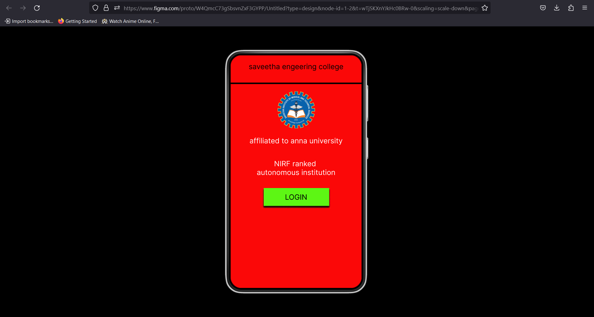
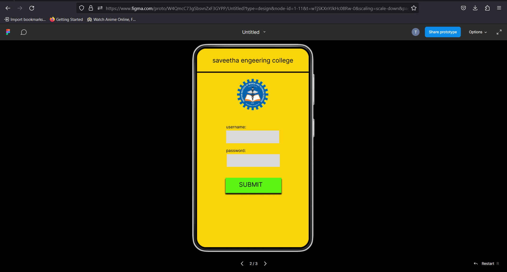
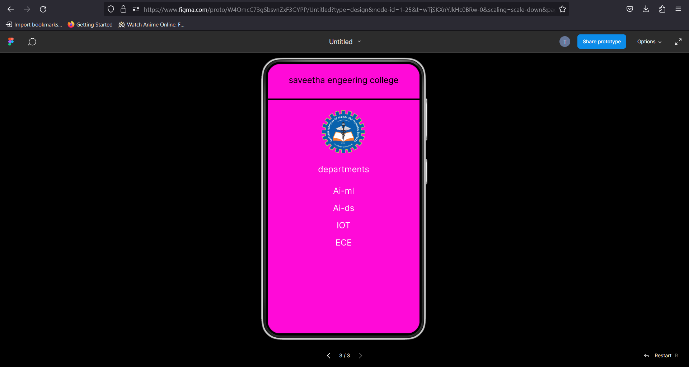

# Event Registration Web Application

## AIM:
To design, develop and deploy a web application for event registration.

## DESIGN STEPS:

### Step 1:
Create a new frame.

### Step 2:
Select any one preset size of your choice.

### Step 3:
Select the shapes you need.

### Step 4:
Import images as needed.

### Step 5:
Create pages based on your need and link them.

### Step 6:

Validate the HTML and CSS code.

### Step 6:

Publish the website in the given URL.

## DESIGN TOOL:
Figma


## code:
```
/* home page */

position: relative;
width: 360px;
height: 640px;

background: #FB0808;


/* saveetha engeering college */

position: absolute;
width: 284px;
height: 41px;
left: 38px;
top: 19px;

font-family: 'Inter';
font-style: normal;
font-weight: 400;
font-size: 20px;
line-height: 24px;
text-align: center;


/* affiliated to anna university */

position: absolute;
width: 284px;
height: 41px;
left: 38px;
top: 223px;

font-family: 'Inter';
font-style: normal;
font-weight: 400;
font-size: 20px;
line-height: 24px;
text-align: center;

color: #FFFFFF;


/* NIRF ranked autonomous institution */

position: absolute;
width: 292px;
height: 49px;
left: 34px;
top: 286px;

font-family: 'Inter';
font-style: normal;
font-weight: 400;
font-size: 20px;
line-height: 24px;
text-align: center;

color: #FFFFFF;


/* Saveetha_Institute_of_Medical_And_Technical_Sciences_Logo 1 */

position: absolute;
width: 103px;
height: 102px;
left: 129px;
top: 99px;

background: url(Saveetha_Institute_of_Medical_And_Technical_Sciences_Logo.png);


/* Line 1 */

position: absolute;
width: 360px;
height: 0px;
left: 0px;
top: 77px;

border: 4px solid #000000;


/* Rectangle 1 */

position: absolute;
width: 180px;
height: 49px;
left: 91px;
top: 365px;

background: #5DF614;
box-shadow: 0px 4px 4px rgba(0, 0, 0, 0.25), 0px 4px 4px rgba(0, 0, 0, 0.25), 0px 4px 4px rgba(0, 0, 0, 0.25), 0px 4px 4px rgba(0, 0, 0, 0.25), 0px 4px 4px rgba(0, 0, 0, 0.25), 0px 4px 4px rgba(0, 0, 0, 0.25), 0px 4px 4px rgba(0, 0, 0, 0.25), 0px 4px 4px rgba(0, 0, 0, 0.25);


/* Line 3 */

position: absolute;
visibility: hidden;
width: 360px;
height: 0px;
left: 0px;
top: 75px;

border: 4px solid #000000;


/* Line 4 */

position: absolute;
visibility: hidden;
width: 360px;
height: 0px;
left: 0px;
top: 75px;

border: 4px solid #000000;


/* LOGIN */

position: absolute;
width: 62px;
height: 24px;
left: 149px;
top: 378px;

font-family: 'Inter';
font-style: normal;
font-weight: 400;
font-size: 20px;
line-height: 24px;
text-align: center;

color: #000000;


/* Saveetha_Institute_of_Medical_And_Technical_Sciences_Logo 2 */

position: absolute;
width: 103px;
height: 102px;

background: url(Saveetha_Institute_of_Medical_And_Technical_Sciences_Logo.png);


/* login page */

position: relative;
width: 360px;
height: 640px;

background: #FAD40B;


/* saveetha engeering college */

position: absolute;
width: 284px;
height: 41px;
left: 38px;
top: 26px;

font-family: 'Inter';
font-style: normal;
font-weight: 400;
font-size: 20px;
line-height: 24px;
text-align: center;

color: #000000;


/* username: */

position: absolute;
width: 284px;
height: 41px;
left: -16px;
top: 244px;

font-family: 'Inter';
font-style: normal;
font-weight: 400;
font-size: 13px;
line-height: 16px;
text-align: center;

color: #000000;


/* Line 2 */

position: absolute;
width: 360px;
height: 0px;
left: 0px;
top: 76px;

border: 4px solid #000000;


/* Saveetha_Institute_of_Medical_And_Technical_Sciences_Logo 2 */

position: absolute;
width: 103px;
height: 102px;
left: 128px;
top: 97px;

background: url(Saveetha_Institute_of_Medical_And_Technical_Sciences_Logo.png);


/* Rectangle 2 */

position: absolute;
width: 171px;
height: 41px;
left: 94px;
top: 264px;

background: #D9D9D9;


/* Rectangle 3 */

position: absolute;
width: 171px;
height: 41px;
left: 96px;
top: 340px;

background: #D9D9D9;


/* password: */

position: absolute;
width: 137px;
height: 22px;
left: 57px;
top: 320px;

font-family: 'Inter';
font-style: normal;
font-weight: 400;
font-size: 13px;
line-height: 16px;
text-align: center;

color: #000000;


/* Rectangle 2 */

position: absolute;
width: 180px;
height: 49px;
left: 92px;
top: 416px;

background: #5DF614;
box-shadow: 0px 4px 4px rgba(0, 0, 0, 0.25), 0px 4px 4px rgba(0, 0, 0, 0.25), 0px 4px 4px rgba(0, 0, 0, 0.25), 0px 4px 4px rgba(0, 0, 0, 0.25), 0px 4px 4px rgba(0, 0, 0, 0.25), 0px 4px 4px rgba(0, 0, 0, 0.25), 0px 4px 4px rgba(0, 0, 0, 0.25), 0px 4px 4px rgba(0, 0, 0, 0.25);


/* SUBMIT */

position: absolute;
width: 77px;
height: 24px;
left: 135px;
top: 426px;

font-family: 'Inter';
font-style: normal;
font-weight: 400;
font-size: 20px;
line-height: 24px;
text-align: center;

color: #000000;


/* SEC page */

position: relative;
width: 360px;
height: 640px;

background: #FF0AD8;


/* saveetha engeering college */

position: absolute;
width: 284px;
height: 41px;
left: 38px;
top: 26px;

font-family: 'Inter';
font-style: normal;
font-weight: 400;
font-size: 20px;
line-height: 24px;
text-align: center;

color: #000000;


/* Line 3 */

position: absolute;
width: 360px;
height: 0px;
left: 0px;
top: 84px;

border: 4px solid #000000;


/* Saveetha_Institute_of_Medical_And_Technical_Sciences_Logo 3 */

position: absolute;
width: 103px;
height: 102px;
left: 128px;
top: 110px;

background: url(Saveetha_Institute_of_Medical_And_Technical_Sciences_Logo.png);


/* departments */

position: absolute;
width: 284px;
height: 41px;
left: 38px;
top: 238px;

font-family: 'Inter';
font-style: normal;
font-weight: 400;
font-size: 20px;
line-height: 24px;
text-align: center;

color: #FFFFFF;


/* Ai-ml */

position: absolute;
width: 284px;
height: 41px;
left: 38px;
top: 289px;

font-family: 'Inter';
font-style: normal;
font-weight: 400;
font-size: 20px;
line-height: 24px;
text-align: center;

color: #FFFFFF;


/* Ai-ds */

position: absolute;
width: 284px;
height: 41px;
left: 38px;
top: 330px;

font-family: 'Inter';
font-style: normal;
font-weight: 400;
font-size: 20px;
line-height: 24px;
text-align: center;

color: #FFFFFF;


/* IOT */

position: absolute;
width: 284px;
height: 41px;
left: 38px;
top: 371px;

font-family: 'Inter';
font-style: normal;
font-weight: 400;
font-size: 20px;
line-height: 24px;
text-align: center;

color: #FFFFFF;


/* ECE */

position: absolute;
width: 284px;
height: 41px;
left: 38px;
top: 412px;

font-family: 'Inter';
font-style: normal;
font-weight: 400;
font-size: 20px;
line-height: 24px;
text-align: center;

color: #FFFFFF;


```

## OUTPUT:










## RESULT:
The program to design, develop and deploy a web application for event registration is completed successfully.
